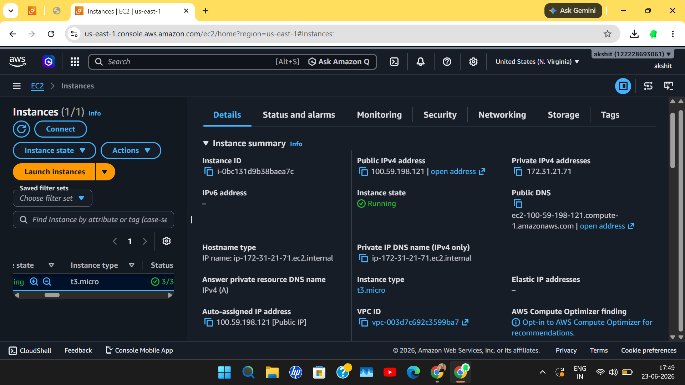
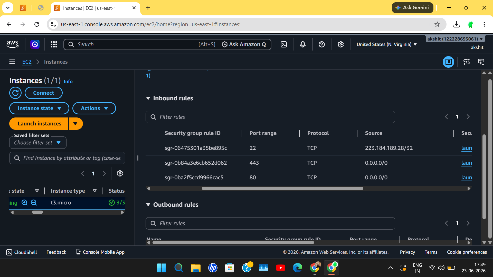

# TASK-2 
# ☁️AWS 

## 🚀 AWS EC2 Web Server Deployment

## 📌 Project Overview

This project demonstrates the deployment of an AWS EC2 instance and configuration of security groups as part of the DecodeLabs Cloud Internship Task.

The objective was to:

✅ Launch an EC2 Instance  
✅ Configure Security Groups  
✅ Enable SSH, HTTP and HTTPS Access  
✅ Verify Instance Status  
✅ Document the Deployment Process

----

## 🛠️ AWS Services Used

- ☁️ Amazon EC2
- 🔒 Security Groups
- 🌐 Public IPv4 Address
- 🖥️ Ubuntu Linux Instance

---

## ⚙️ Instance Configuration

| Parameter | Value |
|------------|---------|
| Instance Name | DecodeLabs-WebServer |
| Instance Type | t3.micro |
| Operating System | Ubuntu |
| Region | us-east-1 (N. Virginia) |
| Platform | Linux/UNIX |

---

## 🔐 Security Group Configuration

### Inbound Rules

| Protocol | Port | Purpose |
|-----------|--------|---------|
| SSH | 22 | Remote Access |
| HTTP | 80 | Web Traffic |
| HTTPS | 443 | Secure Web Traffic |

---

## 📸 Screenshots

### 1️⃣ EC2 Instance Running
- Instance successfully launched.
- Status checks passed.
- Public IP assigned.

# 📂 Screenshot:

---

### 2️⃣ Security Group Rules
- SSH (22)
- HTTP (80)
- HTTPS (443)

# 📂 Screenshot:

---

### 3️⃣ Instance Termination
- Instance terminated after task completion.

📂 Screenshot:
instance-termination.png

---

## 📋 Steps Performed

1. Created AWS EC2 Instance
2. Selected Ubuntu AMI
3. Generated Key Pair
4. Configured Security Group
5. Allowed Ports 22, 80 and 443
6. Verified Instance Running State
7. Captured Deployment Screenshots
8. Terminated Instance After Completion

---

## 🎯 Learning Outcomes

- AWS EC2 Basics
- Instance Management
- Security Group Configuration
- Cloud Infrastructure Deployment
- AWS Console Navigation

---

## 👨‍💻 Author

Akshit Rawat

📧 Cloud Computing Enthusiast  
☁️ AWS Learner  
🚀 DecodeLabs Cloud Internship Candidate

---

## ⭐ Project Status

✅ Task Completed Successfully